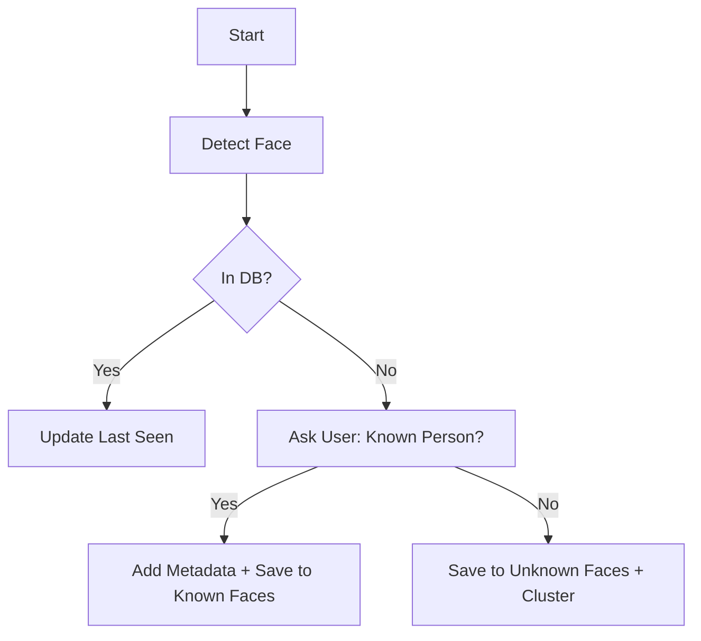

# face-yolo-facenet

# Worflow

```mermaid
graph TD
    A[Start] --> B[Detect Face]
    B --> C{In DB?}
    C -->|Yes| D[Update Last Seen]
    C -->|No| E[Ask User: Known Person?]
    E -->|Yes| F[Add Metadata + Save to Known Faces]
    E -->|No| G[Save to Unknown Faces + Cluster]
```

# References
YOLO Model by AdamCodd: https://huggingface.co/AdamCodd/YOLOv11n-face-detection  
Pytorch's FaceNet repo: https://github.com/timesler/facenet-pytorch
